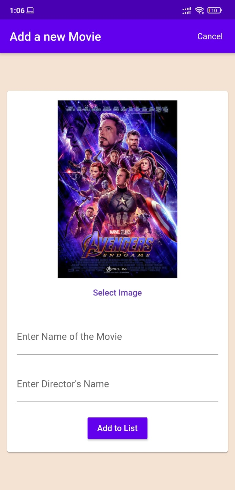
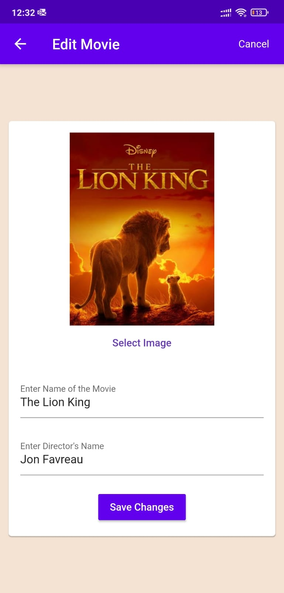
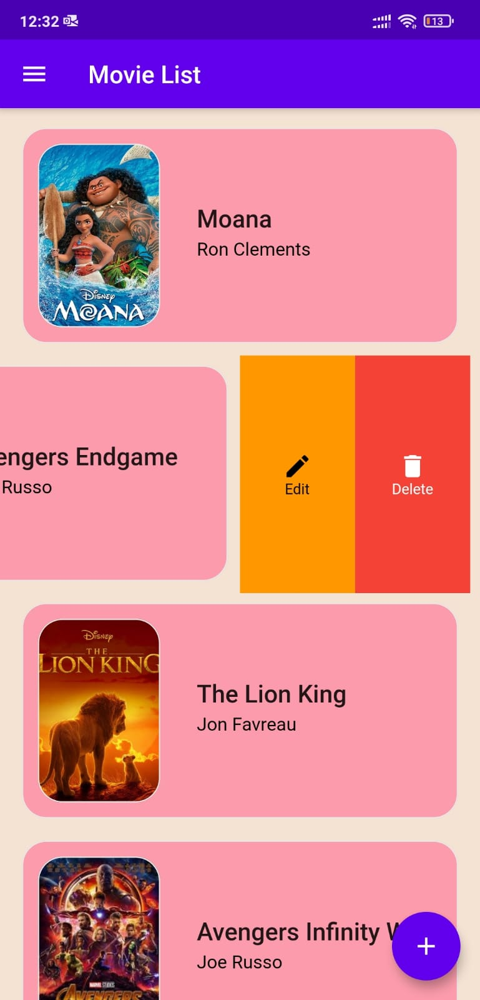

# Movielist

A Flutter app which displays the list of movies which the users has watched .It uses Google Sign In for authentication & Hive (NOSQL database) for storing data.  
  

## Overview & App Screenshots

MovieList App has 4 Pages:

- HomePage
- LoginPage
- AddMovie
- EditMovie 
   

   &nbsp;&nbsp;&nbsp;&nbsp;&nbsp;&nbsp;&nbsp;&nbsp;

I have implemented Snackbar widget to notify when a movie is added,when it is saved after edit & when the movie deleted from the List. Also implemented Slideable widget,with the help of Slideable widget the card can be swiped from right to left,which reveals two option which are Edit and Delete
 
 
 &nbsp;&nbsp;&nbsp;&nbsp; &nbsp;&nbsp;

## Download apk using the Link provided below

- [Link: Movelist app apk](https://drive.google.com/file/d/1ztK_7y_gLbI_Hc5g1dcXS-7RI5u4Im6Q/view?usp=sharing)
